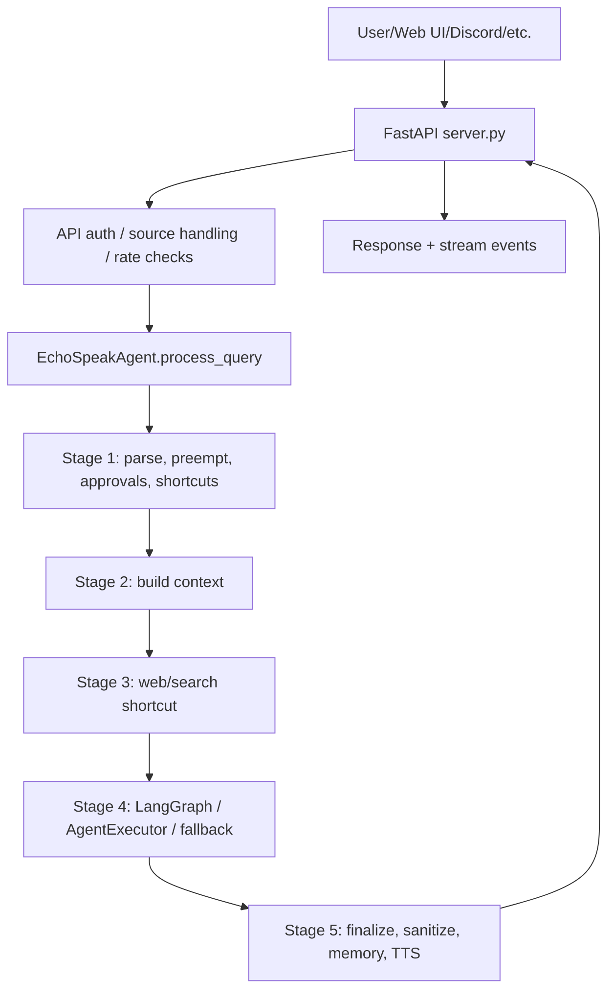
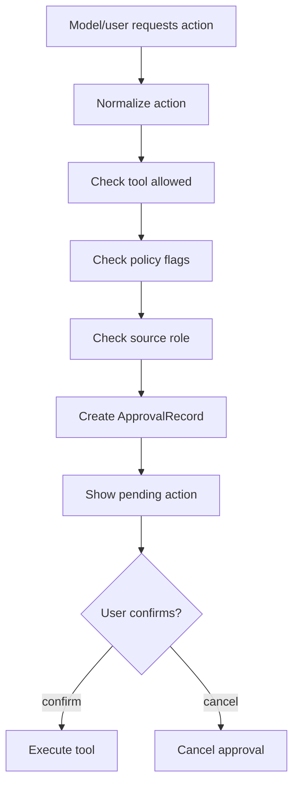
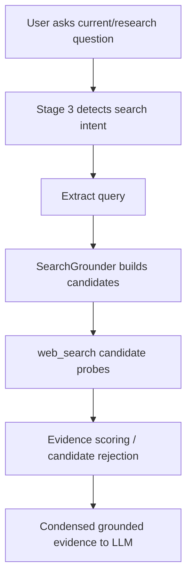
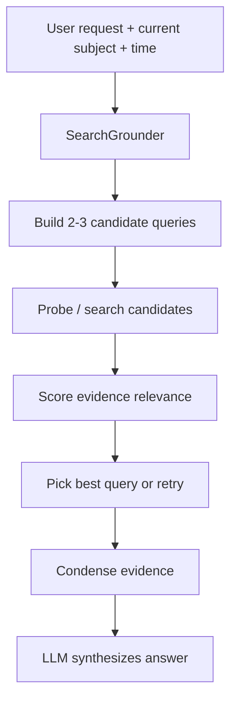
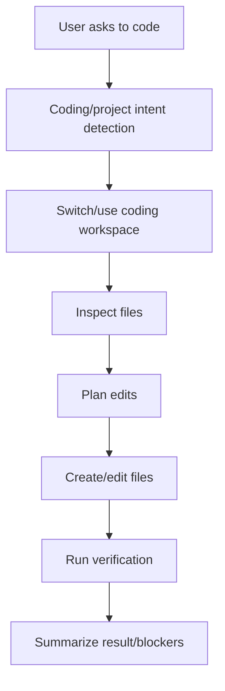

# EchoSpeak Backend Infrastructure

This document explains how EchoSpeak's backend is currently wired, how requests move through the system, where tools and memory attach, and what the next architecture upgrades should be.

It is written for Ty and future contributors who need to understand the full backend, not just one feature at a time.

Current baseline: v7.4.4 Harness Completeness complete (A–F, Gemma-first).

---

## 1. What EchoSpeak Is

EchoSpeak is a local-first autonomous assistant backend with:

- A FastAPI server for the Web UI, streaming chat, settings, memory, documents, routines, provider switching, and integrations.
- A central agent pipeline in `apps/backend/agent/core.py`.
- Local and cloud model provider support.
- Tool execution through LangChain/LangGraph, action-parser fallback, and explicit confirmation gates.
- Memory through profile facts, pinned/typed memories, vector memory, optional file memory, and chat history.
- Research/search through `web_search`, research evidence normalization, and web-result reflection.
- Integrations for Discord, Telegram, Twitch, Twitter/X, email, calendar, Spotify, Notion, GitHub, WhatsApp, Home Assistant, routines, webhooks, and desktop control.
- Safety gates for system actions, terminal commands, file writes, desktop automation, API auth, source roles, approvals, and tool trust metadata.

The big idea: the LLM should not be trusted as the only source of truth. The harness should own state, memory distillation, search grounding, verification, safety, and routing.

---

## 2. Top-Level Backend Layout

```text
apps/backend/
  app.py                         Backend app entry wrapper
  config.py                      Environment config, defaults, feature flags
  SOUL.md                        User-facing personality/context source
  .env.example                   Documented backend environment variables
  api/
    server.py                    FastAPI app, routes, auth, streaming, diagnostics
  agent/
    core.py                      Main EchoSpeakAgent pipeline and tool orchestration
    memory.py                    Profile, vector, typed, pinned, and file memory
    research.py                  Search grounding, evidence scoring, research runs
    context_budget.py            Context headroom/budget manager
    session_memory.py            Continuous per-thread session distillation
    verification.py              Failure-cluster telemetry
    reflection.py                Deterministic and LLM-assisted verification
    adapters.py                  Source/platform adapter compatibility layer
    mcp_client.py                Minimal MCP manager bridge
    tools.py                     Tool implementations and TOOL_METADATA
    tool_registry.py             Tool registry, policy metadata, pipeline plugins
    state.py                     Execution, approval, and session state persistence
    threads.py                   Chat thread state
    stream_events.py             NDJSON task/reasoning/tool stream buffers
    document_store.py            Document RAG
    update_context.py            Repo-backed "what changed" context plugin
    heartbeat.py                 Proactive heartbeat text generation
    proactive.py                 Background proactive tasks
    routines.py                  Scheduled/webhook routines
    projects.py                  Project metadata and active project state
    observability.py             Observability helpers
    security.py                  Security helpers
    orchestrator.py              Multi-step orchestration support
    a2a.py                       Agent-to-agent support
    skills_registry.py           Skill discovery/metadata
  io_module/
    voice.py                     Voice I/O helpers
    stt_engine.py                Speech-to-text
    pocket_tts_engine.py         Local TTS
    personaplex_client.py        PersonaPlex WebSocket client
    vision.py                    Screen capture/OCR helpers
  skills/                        Installed local skills
  workspaces/                    Workspace prompts/tool scopes: chat, coding, research
  routines/                      Routine definitions/state
  data/                          Runtime state: memory, traces, tokens, lessons
  tests/                         Backend unit/regression tests
```

Root-level docs:

```text
README.md                       User-facing overview
ARCHITECTURE.md                 Older architecture overview
CHANGES.md                      Changelog and version notes
ROADMAP.md                      Future direction
AUDIT.md                        Audit notes
docs/AGENT.md                   Developer guide for agent internals
docs/INTEGRATIONS.md            Integration/tooling guide
docs/AGENTIC_BASELINE_2026.md   Research baseline against other agents
docs/PRE_TESTING_TECHNICAL_AUDIT_2026.md
```

---

## 3. Runtime Process Model

The backend runs as a FastAPI application from `apps/backend/api/server.py`.

Primary process responsibilities:

1. Load config from environment through `config.py`.
2. Initialize or retrieve a thread-scoped `EchoSpeakAgent`.
3. Accept HTTP/WebSocket requests.
4. Route user chat requests through `EchoSpeakAgent.process_query()`.
5. Stream reasoning/tool/task events back to the Web UI.
6. Persist thread state, approvals, executions, memory, routines, and traces.
7. Start/stop optional background integrations.

The Web UI does not run the agent itself. It talks to the backend API.

---

## 4. Main Request Flow

High-level chat flow:



The pipeline lives in `agent/core.py`:

- `process_query()` is the entry point.
- `_pq_parse_and_preempt()` handles setup, pending actions, explicit memory commands, adapters, coding intent, Notepad shortcut, and action-parser fallback.
- `_pq_build_context()` builds memory, document, profile, pinned, continuity, time, and chat history context.
- `_pq_shortcut_queries()` handles explicit web/schedule/search fast paths for non-native-tool-calling modes.
- `_pq_invoke_llm_agents()` runs LangGraph, AgentExecutor, and fallback tool agents.
- `_pq_finalize_response()` handles direct LLM fallback, printed `|TOOL|` recovery, post-processing, memory recording, and TTS selection.

---

## 5. API Server Layer

Primary file: `apps/backend/api/server.py`

The API server owns:

- HTTP routes
- Streaming routes
- WebSocket gateway
- Settings endpoints
- Provider readiness
- Memory endpoints
- Document endpoints
- Tool trust/capabilities endpoints
- Coding readiness
- Integrations
- Webhooks/routines
- Threads
- Approvals/executions/traces
- Workspace browsing/changing
- Health/metrics

Important route groups:

```text
Core chat:
  POST /query
  POST /query/stream
  GET  /stream/{request_id}
  GET  /history
  POST /history/clear
  WS   /gateway/ws

Settings/config:
  GET  /settings
  PUT  /settings
  POST /settings/test
  GET  /provider
  POST /provider/switch
  GET  /provider/models

Agent diagnostics:
  GET /doctor
  GET /capabilities
  GET /coding/readiness
  GET /pending-action
  GET /executions
  GET /executions/{execution_id}
  GET /traces/{trace_id}

Memory:
  GET  /memory
  POST /memory/update
  POST /memory/delete
  POST /memory/clear
  POST /memory/compact
  GET  /memory/doctor

Documents:
  GET  /documents
  POST /documents/upload
  POST /documents/delete
  POST /documents/clear

Workspace/code:
  GET  /workspace
  POST /workspace
  GET  /workspace/browse

Automation/routines:
  GET/POST/PUT/DELETE /routines
  POST /routines/{routine_id}/run
  POST /webhooks/{path}
  POST /trigger/cron
  POST /trigger/webhook

Integrations:
  GET/POST /heartbeat
  GET/POST /proactive/*
  GET /discord
  GET/POST /telegram*
  GET/POST /twitch*
  GET/POST /twitter*

Other:
  GET /health
  GET /metrics
  GET/POST/PUT/DELETE /todos
  GET/PUT /avatar/config
```

---

## 6. API Auth And Remote Safety

EchoSpeak is local-first. It should not be exposed to a network without authentication.

Current auth controls:

```text
API_AUTH_ENABLED=false
API_AUTH_KEY=
API_AUTH_LOCALHOST_BYPASS=true
```

When enabled:

- Non-public HTTP endpoints require a shared key.
- `/gateway/ws` also checks the key before accepting the socket.
- Clients can send:
  - `X-EchoSpeak-Key`
  - `X-API-Key`
  - `X-Admin-Key`
  - `Authorization: Bearer <key>`

Public paths are intentionally tiny:

```text
/
/health
/metrics
/favicon.ico
/.well-known/agent.json
```

Settings validation warns when `API_HOST` is network-facing and API auth is off.

Admin restart uses its own `ADMIN_API_KEY`.

---

## 7. Config Layer

Primary file: `apps/backend/config.py`

`Config` reads environment variables and exposes runtime settings.

Major config families:

```text
Model providers:
  USE_LOCAL_MODELS
  LOCAL_MODEL_PROVIDER
  LOCAL_MODEL_URL
  LOCAL_MODEL_NAME
  LOCAL_MODEL_CONTEXT
  OPENAI_API_KEY
  OPENAI_MODEL
  GEMINI_API_KEY
  GEMINI_MODEL

Tool calling:
  USE_TOOL_CALLING_LLM
  LM_STUDIO_TOOL_CALLING
  GEMINI_USE_LANGGRAPH
  ACTION_PARSER_ENABLED
  ACTION_PARSER_MAX_TOKENS

Context trimming:
  LLM_TRIM_MAX_TOKENS
  LLM_TRIM_RESERVE_TOKENS

Search:
  TAVILY_API_KEY
  TAVILY_SEARCH_DEPTH
  TAVILY_MAX_RESULTS
  WEB_SEARCH_TIMEOUT
  WEB_SEARCH_BLOCKED_DOMAINS

Memory:
  MEMORY_AUTO_STORE_CONVERSATIONS
  MEMORY_PARTITION_ENABLED
  MEMORY_IMPORTANCE_ENABLED
  FILE_MEMORY_ENABLED
  FILE_MEMORY_LOG_CONVERSATIONS
  FILE_MEMORY_MAX_CHARS

Document RAG:
  DOCUMENT_RAG_ENABLED
  DOC_CONTEXT_MAX_CHARS
  DOC_HYBRID_ENABLED
  DOC_VECTOR_K
  DOC_BM25_K
  DOC_FINAL_K

Actions:
  ENABLE_SYSTEM_ACTIONS
  ALLOW_FILE_WRITE
  ALLOW_TERMINAL_COMMANDS
  TERMINAL_COMMAND_DENYLIST
  ALLOW_PLAYWRIGHT
  ALLOW_DESKTOP_AUTOMATION
  ALLOW_OPEN_APPLICATION
  ALLOW_SELF_MODIFICATION
  FILE_TOOL_ROOT
  FILE_TOOL_EXTRA_ROOTS

Integrations:
  ALLOW_DISCORD_BOT
  ALLOW_TELEGRAM_BOT
  ALLOW_TWITCH
  ALLOW_TWITTER
  ALLOW_EMAIL
  ALLOW_CALENDAR
  ALLOW_SPOTIFY
  ALLOW_NOTION
  ALLOW_GITHUB
  ALLOW_WHATSAPP
  ALLOW_HOME_ASSISTANT

Automation:
  CRON_ENABLED
  WEBHOOK_ENABLED
  WEBHOOK_SECRET
  HEARTBEAT_ENABLED

MCP:
  MCP_SERVERS
```

Config is also used by the settings UI. Some keys are secret and should never be shown raw.

---

## 8. Model Provider Layer

Provider support lives mostly in `agent/core.py` and `config.py`.

Supported model families:

- OpenAI
- Google Gemini
- Ollama
- LM Studio
- LocalAI
- llama.cpp server
- vLLM

Provider readiness is checked before chat execution. If LM Studio/Ollama/LocalAI/vLLM is unreachable, `/query` and `/query/stream` can return a clear provider-unavailable response rather than falling into a vague LLM failure.

Tool-calling modes:

```text
native_tool_calling_langgraph
native_tool_calling_agent_executor
native_tool_calling_no_executor
json_action_parser_plus_direct_llm
direct_llm_no_tool_calling
```

The mode is reported in diagnostics and execution metadata.

Important behavior:

- OpenAI and Gemini are treated as native tool-calling capable.
- LM Studio can auto-enable native tool calling for Gemma 4 and Qwen-style models.
- If native tool calling is not available, Echo uses an action parser and direct LLM fallback.
- Weak-model printed tool directives like `|TOOL| terminal_run {...}` are recovered into pending actions.

---

## 9. Agent Pipeline In Detail

Primary class: `EchoSpeakAgent` in `agent/core.py`.

### Stage 1: Parse and Preempt

Function: `_pq_parse_and_preempt()`

Responsibilities:

- Set request/source/thread state.
- Handle pending `confirm` / `cancel`.
- Handle explicit remember/save-memory commands.
- Delegate source-specific preprocessing to adapters.
- Detect coding/project intent.
- Use direct shortcuts when appropriate.
- Run the LLM action parser for single actions when native tool calling is not available.
- Create pending approval records for gated actions.

### Stage 2: Build Context

Function: `_pq_build_context()`

Current injected context:

- Extracted user request
- Resolved follow-up input
- Current subject
- Vector memory context
- Pinned memory
- Profile context
- Document RAG context
- Time context
- Chat history messages
- Allowed tool names for this turn

Current weakness:

- There is not yet a single context budget manager that allocates memory/docs/history/profile and reserves fixed headroom before model invocation.

### Stage 3: Shortcut Queries

Function: `_pq_shortcut_queries()`

Current role:

- Detect explicit search, schedule, and follow-up web queries.
- Call web research directly for non-native-tool-calling modes.
- Summarize web results.

Current weakness:

- Search grounding is still partly heuristic and sports-specific.
- The general research layer should own query candidates, evidence scoring, retries, and condensation.

### Stage 4: Invoke LLM Agents

Function: `_pq_invoke_llm_agents()`

Order:

1. LangGraph ReAct/tool-calling graph
2. AgentExecutor
3. Fallback executor
4. Direct LLM fallback later in Stage 5

Stage 4 records diagnostics:

- Tool-calling mode
- Which branch succeeded or failed
- Partial tool results captured before fallback
- Reasoning text emitted from model messages when available

### Stage 5: Finalize Response

Function: `_pq_finalize_response()`

Responsibilities:

- Direct LLM fallback if Stage 4 returned nothing.
- Convert printed `|TOOL|` directives into pending actions.
- Sanitize response text.
- Correct schedule answers when model skips same-day results.
- Source adapter post-processing.
- TTS selection.
- Record the turn into conversation history and optional memory.

---

## 10. Tool System

Primary files:

- `agent/tools.py`
- `agent/tool_registry.py`

There are two layers:

1. LangChain tool functions in `tools.py`.
2. Metadata and policy registry in `TOOL_METADATA` and `ToolRegistry`.

Tool metadata includes:

```text
risk_level:
  safe
  moderate
  destructive

requires_confirmation:
  true / false

policy_flags:
  env/config flags required before tool is enabled
```

Examples:

```text
web_search:
  safe, no confirmation

file_read / file_list:
  safe, no confirmation

file_write / file_move / file_copy / file_mkdir:
  moderate, confirmation required, needs ENABLE_SYSTEM_ACTIONS + ALLOW_FILE_WRITE

terminal_run:
  destructive, confirmation required, needs ENABLE_SYSTEM_ACTIONS + ALLOW_TERMINAL_COMMANDS

file_delete:
  destructive, confirmation required, needs ENABLE_SYSTEM_ACTIONS + ALLOW_FILE_WRITE

desktop_click / desktop_type_text:
  moderate, confirmation required, needs desktop automation flags
```

The backend separates:

- Tool availability
- Workspace allowlist
- Source role
- Policy flags
- Confirmation requirement
- Risk level

This matters because Discord/Twitch/Twitter public sources must not get the same tool power as the local owner.

---

## 11. Approval And Action Safety

Action tools are not supposed to silently execute.

Flow:



Auto-confirm exists only for configured/trusted source cases and is risk-aware. Destructive tools should not auto-confirm.

Terminal safety:

- Old allowlist model was replaced by a denylist.
- This avoids blocking harmless commands only because they were not listed.
- Destructive command names stay blocked by default.

File safety:

- File tools are constrained to `FILE_TOOL_ROOT` and `FILE_TOOL_EXTRA_ROOTS`.
- Desktop can be exposed through `FILE_TOOL_EXTRA_ROOTS`.

---

## 12. Memory System

Primary file: `agent/memory.py`

Current memory tiers:

### A. Raw conversation memory

Written by `add_conversation()`.

It can use:

- FAISS vector store
- Simple in-memory list fallback
- Optional daily file logging if file memory is enabled

This tier is useful for retrieval but should not be treated as perfect state.

### B. Durable typed memory

Written by `add_memory_item()`.

Types:

```text
conversation
preference
profile
project
contacts
credentials_hint
note
```

Supports:

- Deduplication
- Pinned memories
- Namespace/thread/mode metadata
- Sensitive text rejection

### C. Profile memory

Stored in `profile.json`.

Used for deterministic facts:

- User name
- Relation names
- Preferences

This is the strongest memory tier for stable identity facts.

### D. Pinned memory

Retrieved by `pinned_context()`.

Pinned memory is injected separately from general vector search.

### E. File memory

Optional:

- `FILE_MEMORY_ENABLED`
- `FILE_MEMORY_LOG_CONVERSATIONS`
- `FILE_MEMORY_MAX_CHARS`

Current file memory is more like durable logging/curated notes than active session distillation.

---

## 13. Session Memory Architecture

Echo now has a lightweight continuous session distiller in `agent/session_memory.py`.

Memory tiers:

```text
Tier 1: Raw ephemeral conversation
  - Recent chat turns
  - Can be trimmed/degraded
  - Not trusted as durable state

Tier 2: Continuous durable session memory
  - Incrementally updated after completed turns
  - Written before context pressure happens
  - Used when compaction/overflow occurs
  - Stored per thread/session

Tier 3: Static and pinned context
  - Profile facts
  - Pinned memories
  - SOUL
  - Workspace prompt
  - Reloaded fresh every turn
```

Where it attaches:

- `SessionMemoryDistiller` lives in `agent/session_memory.py`.
- `_record_turn()` updates the durable per-thread session file after visible turns.
- `_pq_build_context()` injects session memory as a separate block from vector memory.
- `/memory/doctor` exposes session-memory path, last update, current subject, turn count, and summary size.

Why:

The model has no memory between calls. Durable continuity must be owned by the harness, not the LLM.

---

## 14. Context Construction And Headroom

Current state:

- `llm_trim_reserve_tokens` exists.
- `_resolve_trim_max_tokens()` reserves tokens for LangGraph message trimming.
- `ContextBudgetManager` in `agent/context_budget.py` now budgets Stage 2 injectable context before model invocation.

Problem:

If the context builder stuffs the prompt until it almost fills the model window, small local models lose working room. The model needs space to reason, not just read.

The budget manager allocates:

```text
Total model window
  minus reserved reasoning headroom
  minus system prompt and SOUL
  minus user request
  minus tool scratchpad allowance
  = injectable context budget
```

Then divides injectable budget across:

- Pinned/profile facts
- Current subject/session summary
- Document RAG
- Vector memory
- Recent chat history
- Time/update context

Priority order:

1. Safety/system/workspace instructions
2. Current user request
3. Profile/pinned facts
4. Current subject and session summary
5. Fresh tool/search evidence
6. Document context
7. Retrieved memory
8. Raw chat history

This prevents memory/docs from crowding out reasoning, especially for local 4B-class models.

---

## 15. Research And Search Layer

Primary files:

- `agent/tools.py`: `web_search`
- `agent/research.py`: search intent, candidates, evidence scoring, grounded result packets
- `agent/core.py`: `WebTaskReflector`, `_invoke_web_research_query()`, `_pq_shortcut_queries()`

Current flow:



Current strengths:

- Explicit web fast path exists.
- Research result normalization exists.
- General search grounding exists for explicit search shortcuts.
- Live/current score requests stay anchored to score/result/live query language.
- Stale schedule logic exists.

Current weakness:

- Native model tool-call `web_search` post-processing still needs the same grounding layer consistently applied after every tool result.
- Search candidate scoring is deterministic and lightweight; it should gain more fixtures/evals over time.

---

## 16. Search Grounding Layer

`SearchGrounder` is implemented in `apps/backend/agent/research.py`.

Recommended home:

```text
apps/backend/agent/research.py
```

Responsibilities:

1. Intent extraction
2. Query candidate generation
3. Deterministic disambiguation
4. Probe searches
5. Evidence scoring
6. Retry/fallback
7. Condensed evidence packet for the LLM

Grounded flow:



The LLM should synthesize from evidence. It should not be the sole judge of whether the evidence matched the request.

Examples:

If user asks:

```text
what's the score right now for Canada vs Morocco?
```

Bad query:

```text
Canada FIFA World Cup game date
```

Grounded candidates:

```text
Canada Morocco live score today
Canada vs Morocco current score result
Canada Morocco match live updates
```

The grounder runs lightweight checks and picks the candidate with score/result/live evidence.

---

## 17. Reflection And Verification

Primary file: `agent/reflection.py`

Current verification:

- Deterministic terminal exit-code checks
- File write/move/copy/delete checks
- File read/list empty/failure checks
- JSON well-formedness checks
- Plan-level deterministic failure checks
- LLM reflection only when deterministic checks cannot decide

This is good, but the next version should not verify every step equally.

Current extension:

`agent/verification.py` adds `VerificationTelemetry` for failure clusters. Search grounding, action-parser/printed-tool failures, terminal non-zero exits, file operation failures, and max reflection cycles now create structured telemetry events.

Track failures by:

- Tool name
- Step type
- Error reason
- Retry count
- Whether deterministic check caught it
- Whether LLM self-grading accepted a bad result
- Whether user corrected the answer later

Then weight verification toward risky clusters:

High verification:

- Search query formation
- Search evidence relevance
- Tool argument extraction
- Terminal exit results
- File path/target correctness
- Destructive actions

Low verification:

- Simple file read with non-empty output
- Time lookup
- Calculator
- Project update context

This reduces latency while improving real quality.

---

## 18. Document RAG

Primary file: `agent/document_store.py`

API routes:

```text
GET  /documents
POST /documents/upload
POST /documents/delete
POST /documents/clear
```

Config:

```text
DOCUMENT_RAG_ENABLED
DOC_CONTEXT_MAX_CHARS
DOC_HYBRID_ENABLED
DOC_VECTOR_K
DOC_BM25_K
DOC_FINAL_K
DOC_RERANK_ENABLED
DOC_GRAPH_ENABLED
```

Documents feed Stage 2 context through `_get_document_context()`.

Target improvement:

Document context should also pass through the future `ContextBudgetManager`, so large docs do not crowd out working headroom.

---

## 19. Streaming And UI Events

Streaming paths:

- `POST /query/stream`
- `GET /stream/{request_id}`

Stream event types include:

- Reasoning/thinking
- Tool start/end/error
- Research evidence
- Task plan
- Task step
- Task reflection
- Status

Task planner emits:

- `task_plan`
- `task_step`
- `task_reflection`

Frontend uses these to render:

- Thinking/reasoning timeline
- Transparent task checklist
- Tool activity
- Research panel
- Coding readiness
- Memory Doctor
- Tool Trust Center

---

## 20. Coding Agent Infrastructure

Coding support is built from several pieces:

```text
workspaces/coding/WORKSPACE.md
tools.py file tools
terminal_run
workspace endpoints
Code panel / Workspace Explorer
approval flow
coding/readiness endpoint
```

Coding request flow:



Important safety:

- File writes require confirmation.
- Terminal commands require confirmation unless source auto-confirm policy safely allows.
- Terminal has a denylist.
- File paths are restricted to allowed roots.
- Code panel can show diffs and pending approvals.

---

## 21. Workspaces And Skills

Workspaces:

```text
workspaces/chat
workspaces/coding
workspaces/research
```

Each workspace can define:

- `WORKSPACE.md`
- `TOOLS.txt`
- `SKILLS.txt`

Skills live in:

```text
apps/backend/skills/
```

Skills provide:

- Extra instructions
- Optional tools
- Integration-specific behavior

The active workspace helps constrain what tools and behavior Echo should prefer.

---

## 22. State Persistence

Primary files:

- `agent/state.py`
- `agent/threads.py`
- `agent/projects.py`
- `agent/routines.py`

State types:

- Thread state
- Pending approvals
- Executions
- Traces
- Projects
- Routines
- Memory
- Provider/config
- Integration token files
- Twitter autonomous approval state
- Agent lessons

The important design rule: pending approvals and execution state should survive across turns so Echo does not forget what it asked the user to confirm.

---

## 23. Integrations

### Discord

Files:

- `discord_bot.py`
- Discord tools in `agent/tools.py`
- Discord skills under `skills/`

Modes:

- Bot read/send through Discord API
- Web automation through Playwright
- DM approve/reject for autonomous tweets

Safety:

- Discord server source is heavily restricted.
- Public users do not get owner tools.
- Discord diagnostics appear in `/doctor`.

### Telegram

File:

- `telegram_bot.py`

Features:

- Send messages
- Bot allowed users
- Auto-confirm policy

### Twitch

File:

- `twitch_bot.py`

Features:

- Chat bot
- EventSub endpoint
- Public-source role safety

### Twitter/X

File:

- `twitter_bot.py`

Features:

- Tweet posting
- Mention checks
- Autonomous tweets
- Approve/reject flow
- Changelog/update grounding

### Email

Tools:

- `email_read_inbox`
- `email_search`
- `email_get_thread`
- `email_send`
- `email_reply`

Send/reply are moderate actions and require confirmation.

### Other Skills

Optional skills include:

- Calendar
- Spotify
- Notion
- GitHub communications
- WhatsApp
- Smart home
- System monitor
- A2A agents

---

## 24. Heartbeat And Proactive Systems

Heartbeat:

- File: `agent/heartbeat.py`
- Text-only generation
- Does not go through full `process_query()`
- No tools
- No plans
- Sanitizes output before routing

Proactive:

- File: `agent/proactive.py`
- Background task support

Routines:

- File: `agent/routines.py`
- Cron and webhook triggers

Webhook security:

- `/trigger/webhook`
- `/webhooks/{path}`
- HMAC verification when `WEBHOOK_SECRET` or `WEBHOOK_SECRET_PATH` is configured.

---

## 25. MCP Status

Config supports:

```text
MCP_SERVERS
```

Current reality:

- Trust metadata can show configured MCP servers.
- `apps/backend/agent/mcp_client.py` does not currently exist.
- Therefore MCP is reported as `client_missing`, not available capability.

Correct mental model:

```text
Configured MCP metadata != usable MCP tools
```

Before MCP is real, Echo needs:

1. MCP client implementation.
2. Server trust registry.
3. Transport config.
4. Tool namespace mapping.
5. Permission/risk metadata.
6. Sandbox posture.
7. UI trust display tied to real loaded tools.

---

## 26. Diagnostics And Observability

Important diagnostics:

```text
GET /doctor
GET /capabilities
GET /coding/readiness
GET /provider
GET /executions
GET /traces/{trace_id}
GET /metrics
```

`/doctor` reports:

- Provider health
- Memory health
- Tool-calling mode
- Last Stage 4 branch
- Workspace/file/terminal posture
- Discord/Telegram/Twitch/Twitter readiness
- Routine webhook signing
- MCP availability status

`/capabilities` reports:

- Tool list
- Risk counts
- Origin counts
- Local vs MCP
- Policy blocks
- Trust state
- Usage stats

`/coding/readiness` reports:

- Provider readiness
- Required coding tools
- File root
- Terminal denylist
- Workspace information

---

## 27. Current Architecture Strengths

EchoSpeak already has strong foundations:

- Local-first agent control plane.
- Rich tool set.
- Tool risk metadata.
- Approval records.
- Thread/session state.
- Multi-source role safety.
- Provider readiness.
- Memory Doctor.
- Tool Trust Center.
- Coding readiness.
- Workspace Explorer.
- Inline code diffs.
- Reflection engine with deterministic checks.
- Web search retries for known failure cases.
- Diagnostics surfaces.
- Routine/webhook support.
- Bot/social integrations.

The project does not lack capability. It needs sharper boundaries around state, grounding, budget, and verification.

---

## 28. Current Architecture Gaps

### Gap 1: Session memory needs richer distillation

The backend now has `SessionMemoryDistiller`, but it is deliberately deterministic and lightweight. It tracks current subject, facts, preferences, tasks, questions, decisions, and summary without calling an LLM.

Next refinement:

- Add an optional background distillation job for deeper summaries.
- Add UI controls for pinning, pruning, and editing session-derived items.
- Keep raw chat, session summary, and profile/pinned memory visibly separate.

### Gap 2: Context budget end-to-end — largely closed in v7.4.2

Stage 2, Stage 5 finalize, mid-task tool outputs, and `fit_text` reinjection use the same manager. Summarize/compact **compress** non-protected content (head+tail). Remaining: UI/doctor visibility polish and model-specific token estimators.

### Gap 3: Search grounding path parity — closed in v7.4.0

`_grounded_web_search()` is the single entry point for Stage 3, TaskPlanner/WebTaskReflector, and native LangGraph `web_search` tools. Insufficient evidence returns structured `SEARCH_EVIDENCE_INSUFFICIENT` packets. Remaining work is multi-domain eval fixtures (v7.4.4) and Research-panel surfacing of accepted/rejected candidates.

### Gap 4: Verification telemetry needs UI and policy feedback

`VerificationTelemetry` now records high-risk failure clusters. The next step is making those clusters actionable in the UI and planner.

Next refinement:

- Show recent failure clusters in Doctor/Trust UI.
- Use cluster counts to choose stronger verification for fragile step types.
- Feed repeated failures into `agent_lessons.json` after review.

---

## 29. Recommended Next Implementation Order

### Step 1: Native Tool-Call Grounding — done (v7.4.0)

Shared `_grounded_web_search()` wraps Stage 3, TaskPlanner, and native LangGraph tools.

### Step 2: Reliability UI

Expose:

- Context budget kept/trimmed blocks
- Session memory current subject and summary
- Search candidates accepted/rejected
- Verification failure clusters

### Step 3: Workspace/Tool Policy Cleanup

Remaining full-suite failures show policy/test drift around workspace allowlists, project update context exposure, action confirmation behavior, and LangChain `StructuredTool` callability expectations.

### Step 4: Evaluation Harness

Build a repeatable task set for coding, search, memory continuity, Discord/social context, and tool-permission scenarios. Store expected outcomes as fixtures so Echo can be compared across local model/provider changes.

---

## 30. Testing Strategy

Focused tests should cover:

```text
Memory:
  - profile facts always reload
  - pinned memory injected separately
  - session summary updates without compaction
  - raw history can trim without losing static context

Context budget:
  - reserved headroom is preserved
  - docs/memory/history are trimmed by priority
  - current subject survives trimming

Search grounding:
  - score query does not become date query
  - ambiguous follow-up uses current subject
  - candidate query with strongest evidence wins
  - weak evidence triggers retry

Reflection:
  - terminal ExitCode=1 fails
  - file write success passes
  - max cycles becomes blocker, not success
  - search evidence mismatch gets high verification

API/auth:
  - non-local requests require key when auth enabled
  - WebSocket rejects missing key
  - localhost bypass works when enabled

MCP:
  - configured but missing client reports unavailable
```

Known local test caveat:

- A full dependency install may require Windows build tools for packages like `llama-cpp-python`.
- Focused tests can run with a smaller dependency set.
- Pytest temp path may need to be forced into the workspace on restricted Windows environments.

---

## 31. Mental Model For Future Work

The LLM should do:

- Language understanding
- Natural synthesis
- User-facing explanation
- Ambiguous judgment only when deterministic systems cannot decide

The harness should do:

- State continuity
- Memory distillation
- Search query construction
- Evidence scoring
- Tool permission checks
- Action approvals
- Verification
- Context budgeting
- Safety roles
- Integration readiness

If a feature relies on "the model will probably remember/notice/verify it," it is fragile. Move that responsibility into code.

---

## 32. Short Summary

EchoSpeak's backend is now an agent platform, not just a chat wrapper.

The current system already has:

- FastAPI control plane
- Agent pipeline
- Tool registry
- Safety gates
- Memory layers
- Search tools
- Reflection engine
- Coding workspace
- Integrations
- Diagnostics

The next reliability jump comes from four architectural subsystems:

1. General search grounding
2. Explicit context budget/headroom
3. Continuous session memory distillation
4. Failure-cluster-weighted verification

Implement those in that order.
