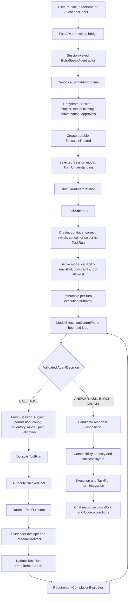

# EchoSpeak Current-State Architecture Audit

> **Historical audit snapshot (2026-07-21).** The consolidation described in
> this document has since been implemented in the current dirty worktree.
> `SYSTEM_ARCHITECTURE.md`, `RUNTIME_CONTRACTS.md`, and
> `ECHO_CORE_CONTRACT_MATRIX.md` now describe active production ownership.

Date: 2026-07-21

Scope: current dirty worktree, including uncommitted EchoSpeak 8.0 runtime and desktop work

Method: production-path static trace plus comparison with primary runtime guidance

This document describes the system that exists in code. It deliberately distinguishes active production behavior from compatibility code, projections, scaffolds, and intended architecture.

## Executive verdict

EchoSpeak is now fundamentally a single-model, runtime-governed agent loop. The active center is coherent:

- a Session owns its selected provider/model binding and active Project attachment;
- the selected Session model performs typed Turn Understanding;
- TaskRun owns semantic requirements and their durable status;
- the model proposes bounded decisions inside ModelExecutionControlPlane;
- the runtime authorizes every tool call;
- ToolRun and ToolOutcome own execution truth;
- ResearchArtifact and EvidenceEnvelope carry research evidence;
- RequirementCompletionEvaluator computes requirement sufficiency;
- the existing response boundary is meant to be the only finalization gate.

The main problem is not a missing agent framework. It is that compatibility-era code still participates after the canonical loop. EchoSpeak has one intended architecture surrounded by older planners, graph projections, session action arrays, grounding guards, finalization heuristics, and domain-specific search orchestration. Those layers can independently reinterpret whether work is allowed, complete, verified, or successful. This is why apparently valid work can become blocked late in a Turn and why fixes tend to add another exception instead of removing the conflicting decision.

The correct next move is consolidation, not another feature layer.

## What EchoSpeak actually is



The upper and middle portions are the canonical design. The `Compatibility honesty and success layers` box is the structural fault line: several independent functions can change response text or success after the control plane and completion evaluator have already made their decisions.

## Real end-to-end Turn flow

### 1. Ingress and Session actor

`POST /query`, channel adapters, routines, and heartbeats eventually call `EchoSpeakAgent.process_query()`. The API obtains a Session-keyed agent from a bounded pool. The agent is recreated if the Session model binding changes. Navigation does not create Sessions; the explicit thread creation endpoint owns that. Sending a message with a valid Session is the normal query path.

The desktop application does not contain a separate agent runtime. Tauri starts the packaged Python backend as a loopback-only sidecar with a per-launch key. Renderer requests use the authenticated local transport. The browser build and desktop shell both reach the same FastAPI/runtime implementation.

### 2. Canonical runtime entry

`EchoSpeakAgent.process_query()` delegates directly to `CanonicalSemanticRuntime.run()`. The old `process_query` pipeline remains in `core.py` as `_process_query_legacy_disabled`; ordinary API, desktop, channel, routine, and heartbeat Turns do not enter it.

`CanonicalSemanticRuntime` serializes Turns per Session, resets a large set of mutable per-turn agent fields, selects the Session runtime, migrates legacy TaskRun state, rehydrates durable Session state, restores exact pending approvals, checks structural corruption, verifies the Session model binding, and creates an `ExecutionRecord` before model work starts.

The per-Session lock is necessary because an `EchoSpeakAgent` is still a mutable actor. The amount of mutable state reset at Turn entry is a warning: the actor owns caches and compatibility fields that should eventually become explicit Turn-local objects.

### 3. Turn Understanding

Only exact typed controls, such as an approval endpoint carrying an exact approval ID, bypass semantic interpretation. Normal text always goes to the selected Session model.

The Turn Understanding envelope contains:

- Echo identity and Soul projection;
- current user text and bounded recent conversation;
- exact Session and Project context;
- eligible suspended TaskRuns with revisions;
- pending approval summaries;
- an authorized memory projection;
- recent explicitly verified outcomes;
- entity candidates and available capability categories.

The model returns `TurnInterpretation`. A single provider-independent decoder folds only documented property-name and enum-format variants, rejects collisions, and then applies strict Pydantic validation with unknown fields forbidden. Provider-native structured output is used when capability detection says it is supported; other paths use bounded extraction. Truncation is detected through finish metadata and may receive a bounded retry on the same selected model. There is no hidden second model for understanding.

### 4. TaskRun arbitration

`TaskArbitrator` interprets the typed relation:

- casual, ambiguous, blocked, and approval-control relations do not select a TaskRun;
- new task creates a TaskRun and runtime-generated requirements;
- continue/provide-input retains compatible requirement state;
- correct reconciles the active requirement set and archives removed requirements;
- switch supersedes the old TaskRun and creates a replacement;
- cancel terminalizes the exact selected TaskRun.

Selection is checked against the exact eligible candidate set and revision seen by Turn Understanding. A stale, wrong-scope, terminal, quarantined, or superseded task fails closed.

TaskRun is the intended semantic owner, but it currently stores several overlapping descriptions of progress: requirements/states, a model-authored plan, a compatibility execution graph/state, verified-outcome summaries, workflow stage, and legacy provenance. In addition, `TaskPlanner` is rehydrated from `TaskRun.plan`, while `ThreadSessionState` retains completed/failed action arrays. Only requirements/states should control semantic completion; the rest should be projections or diagnostics.

### 5. Mode, capabilities, and immutable authority

The runtime derives a mode, execution profile, constraints, and allowed tools from the interpretation, TaskRun, provider/model, tool inventory, permissions, and current Project scope. It then binds an immutable per-turn authority snapshot.

This separation is correct:

- the model proposes what to do;
- the runtime owns what is available and permitted;
- the ToolRegistry owns the inventory contract;
- current state is revalidated before effects occur.

A compatibility repair currently rewrites a tool-free Chat TaskRun into answer-only requirements. It prevents false partial-research failures, but it also masks upstream misclassification by changing the TaskRun contract after arbitration. That repair should disappear once Turn Understanding and mode derivation share one reliable requirement classification.

### 6. Model execution loop

`ModelExecutionControlPlane` compiles a `ModelTurnEnvelope` and runs a bounded sequential loop:

1. call the selected Session model;
2. adapt the provider/family response into a common representation;
3. validate a typed `AgentDecision` against current runtime state;
4. if it is a tool request, execute it through the governed boundary and return the ToolOutcome to the same model;
5. refresh the envelope and continue;
6. stop on an accepted answer, clarification, block, cancel, bounded recovery exhaustion, or loop limit.

Invalid proposals become structured runtime feedback for bounded repair. Tool failures are returned to the model as tool results; they are not themselves successful evidence. This is the right agentic pattern: model decisions alternate with environmental ground truth under a bounded runtime.

The loop also accepts `UPDATE_PLAN`. The plan is persisted and repopulates the legacy `TaskPlanner`. This is unnecessary authority ambiguity. A plan may help the model and UI, but it should never control requirements, eligibility, or completion.

### 7. Tool authority and execution truth

Every model-visible LangChain tool is wrapped by `AuthorityCheckedTool`. Its call reaches `_invoke_authorized_raw_tool`, which revalidates the current registry entry, argument schema, Session, Project/root, provider/model binding, permissions, configuration, allowed tool/action, approval identity, and mutation preconditions.

The runtime creates one durable ToolRun and then persists one normalized ToolOutcome. The ToolOutcome has separate axes for execution status and result state. A tool can execute successfully while returning no requested information. Evidence-required completion must additionally have explicit runtime verification.

This audit repaired one concrete violation: some model-envelope and recent-outcome projections treated any non-empty verification metadata as verified. `{"verified": false}` could therefore enter a later model Turn as verified evidence. Verified projections now require all three:

- execution status is `success`;
- result state is usable;
- verification contains explicit `verified: true`.

Tool errors still return to the active model loop with their runtime metadata; they simply cannot satisfy requirements.

Tool lifecycle recording is more complicated than necessary. Tool execution, callbacks, boundary recording, and idempotency guards can all observe the same outcome. The durable store prevents a terminal ToolRun from being reopened, but the design should converge on one direct persistence call and make callback events read-only projections of that stored record.

### 8. Research and evidence

The new typed research core is real:

- `TurnRequirement` defines independent objectives and requested fields;
- `RequirementState` owns attempt IDs, evidence IDs, coverage, missing fields, contradictions, and budgets;
- `CapabilityDescriptor` and snapshots describe available tools/providers;
- `EvidenceEnvelope` normalizes provenance and semantic coverage;
- `RequirementCompletionEvaluator` demotes retrieval states that lack verified evidence;
- safe public-page retrieval validates schemes, ports, credentials, DNS, every redirect, public IPs, content type, size, and time limits, and extracts JSON-LD, semantic markup, tables, metadata, and visible text.

However, the production `web_search` tool still wraps the older `SearchGrounder` orchestration inside `core.py`. A single governed ToolRun can hide live-domain classification, sports short-circuits, query decomposition, provider selection, caching, search-loop suppression, hard-coded FIFA/schedule limits, and several provider calls. This is effectively an agent/workflow inside a tool.

That violates the visibility needed by the new requirement architecture: TaskRun cannot authoritatively budget, retry, or attribute every hidden acquisition attempt. Search should become one thin acquisition capability per attempt. Requirement recovery—not the `web_search` wrapper—should decide whether to change query, provider, source, specialized capability, or extraction method.

Domain-specific code is justified where it is a real structured adapter, such as weather or sports data. It is not justified when keywords in generic completion or search logic silently change lifecycle semantics. Current weather, FIFA, score, schedule, flight, price, and other regex repairs are evidence that classification and capability contracts are still inconsistent.

### 9. Memory and context

There are three relevant memory forms:

1. `ConversationMemory`: an ephemeral, bounded projection of the durable Session timeline for model continuity.
2. `AgentMemory`: durable account, Project, and Session-scoped records with an authorized runtime projection.
3. `MemoryCurator`: the sole intended authority for durable memory writes, including sensitivity and confirmation policy.

This ownership is coherent. Public channel users are prevented from writing owner memory, Project and Session memory are scope-filtered, and the same authorized projection can be used by Turn Understanding and the execution model.

`SessionMemoryDistiller` is a legacy fourth representation. It is still configured, instantiated, exposed in diagnostics, and referenced by compatibility code, but the canonical Turn path does not update it. It should be removed from product configuration and canonical diagnostics after migration consumers are proven absent. Keeping an inert memory subsystem makes operators and future code believe it is authoritative when it is not.

Context assembly is still largely in `core.py` and combines conversation, Project information, memory, documents, TaskRun state, partial tool results, skills, and time data. The context budget manager is useful. The risk is duplication: some of the same state exists in the Turn Understanding envelope, model envelope, composite execution input, and finalization prompt. Context should be compiled once per model stage from typed projections, not reconstructed through string conventions.

### 10. Approval lifecycle

Approval identity is strong. `ApprovalRecord` stores immutable TaskRun, requirement, attempt, Execution, action, argument hash, Project, model-binding revision, policy snapshot, and mutation preconditions. Consumption restores the exact TaskRun and attempt, checks the stored revision, and then the raw tool boundary performs fresh current validation. Stable identity does not substitute for current authority.

The remaining defect is implementation routing. Exact canonical approval confirmation calls the large compatibility `_pq_parse_and_preempt("confirm", ...)` function. That function contains the old TaskPlanner, pending-action, memory, shortcut, and file-write verification logic. The action still reaches `AuthorityCheckedTool`, so it does not bypass the raw tool authority boundary, but the canonical lifecycle depends on a legacy orchestration function and repeats parts of postcondition handling.

Approval confirmation should instead call a small canonical operation:

1. load exact ApprovalRecord and TaskRun lineage;
2. resume the exact requirement/attempt with revision checks;
3. build current authority;
4. call the same governed tool executor used by the control plane;
5. store ToolOutcome/evidence;
6. evaluate requirements;
7. return through the one finalization gate.

### 11. Completion and finalization

`RequirementCompletionEvaluator` is a good sole sufficiency function. It decides complete, partial, blocked, input-required, or pending from required states, missing user inputs, pending approval, and explicit evidence.

Production does not yet have one effective finalization decision. After the model loop returns, the following can still reinterpret the result:

- capability-claim honesty;
- mutation-claim honesty;
- recovery-claim honesty;
- research-evidence honesty;
- volatile-retrieval enforcement;
- response grounding;
- a second synthetic `ANSWER` validation;
- `_pq_finalize_response` success derived from Session failed-action arrays and the last outcome;
- `_finalize_execution_record` mode, planner, tool-name, verification, and “accepted search” heuristics;
- `_finish_task` TaskRun terminalization.

These functions were added for valid reasons, but together they form a second policy engine. In particular, `_finalize_execution_record` can restore success because a tool name is in an accepted-search set or downgrade it because planner projections imply missing actions. That competes with requirement states and evidence sufficiency.

The target is one transition:

```text
validated decision
+ current TaskRun completion verdict
+ durable approval/ToolRun state
-> one FinalizationDisposition
-> atomically persist Execution and TaskRun terminal state
-> present response
```

Honesty checks should become inputs to evidence verification or decision validation, not late prose-rewriting completion authorities.

### 12. Work, Code, Chat, and UI truth

Chat is the compact conversational projection. Work is a read-only Session/Project-keyed store over TaskRun detail. It fetches requirements, states, completion, approvals, executions, ToolRuns, artifacts, coding ledgers, and media jobs. It does not create TaskRuns through navigation. Its explicit handoff action creates a replacement TaskRun after checking TaskRun and model-binding revisions.

Code uses real Project-scoped file, diff, terminal, preview, and ToolRun data. Direct preview endpoints are retired with HTTP 410; preview start and stop are governed tools requiring confirmation and terminal/system permissions.

The UI boundary is directionally correct, but not fully canonical:

- Work detail joins several stores at read time without a snapshot revision, so one response can contain records from slightly different moments;
- Work types use broad `Record<string, any>` structures, weakening contract drift detection;
- Work prominently renders compatibility graph state;
- Code combines TaskRun/ToolRun truth with `ThreadSessionState` mode, phase, and objective projections that can disagree;
- the main web application remains concentrated in a very large `index.tsx`;
- compiled `.js`/`.d.ts` copies coexist with TypeScript sources in `src`, while the research feature still uses JavaScript intentionally. These files need an import/build ownership audit before deletion.

The frontend must never infer completion from assistant prose, navigation, callbacks, or local state. Backend IDs and revisions should remain authoritative.

### 13. Background work

Routines and heartbeat occurrences use the canonical runtime and create occurrence/lifecycle records. They currently involve ProductTask, AutomationRun, Execution, and TaskRun projections. That is acceptable only if AutomationRun owns the lease/occurrence and every other status is explicitly derived.

`ProactiveEngine` remains a separate older scheduler with its own queue, history, synthetic Session IDs, and API endpoints. It calls the canonical query runtime, but it does not share the modern AutomationRun occurrence lifecycle. External `route_message` delivery is currently blocked and only logs a warning, so it is not an active external-send bypass. It is still a competing background-work architecture and a misleading product surface. Migrate its schedules into the routine owner, then retire its scheduler and endpoints.

## Authority map

| Concern | Real owner | Current conflict |
|---|---|---|
| Session metadata | ThreadManager | None significant |
| Active Project attachment | ThreadSessionState | Code and legacy fields sometimes repeat Project context |
| Project roots/metadata | ProjectManager | None significant |
| Selected provider/model | SessionModelBinding | Global settings still seed defaults and expose old research-model config |
| Turn semantic relation | TurnInterpretation | Mode/domain regexes can repair or override consequences later |
| Requirement definitions/state | TaskRun | Plan, graph, TaskPlanner, workflow stage, and Session action arrays overlap |
| Tool inventory | ToolRegistry | Older wrapper collections can become stale projections |
| Execution truth | ToolRun/ToolOutcome | Callback and Session completed/failed arrays duplicate it |
| Research evidence | EvidenceEnvelope/ResearchArtifact | SearchGrounder hides sub-attempts inside one ToolRun |
| Research sufficiency | RequirementCompletionEvaluator | Late honesty and success heuristics compete with it |
| Approval identity | ApprovalRecord | Confirmation routes through legacy preemption |
| Durable memory writes | MemoryCurator/AgentMemory | SessionMemoryDistiller remains a false fourth owner |
| Background occurrence | AutomationRun | ProactiveEngine owns a parallel queue/history |
| Final response disposition | Control-plane finalization boundary | Several post-loop functions can change success or response semantics |
| UI completion/status | Backend projections | Work/Code mix owners and broad untyped objects |

## What should remain

Keep these foundations:

- CanonicalSemanticRuntime as the only ordinary-turn coordinator.
- One selected Session model for Turn Understanding and execution.
- Strict provider-independent TurnInterpretation decoding and validation.
- Bounded ModelExecutionControlPlane model/tool loop.
- Immutable per-turn authority plus fresh pre-effect revalidation.
- ToolRegistry, AuthorityCheckedTool, durable ToolRun, and normalized ToolOutcome.
- TaskRun as requirement-state owner.
- RequirementCompletionEvaluator as the sufficiency owner.
- Exact approval lineage and stable-identity/fresh-authority checks.
- AgentMemory plus MemoryCurator and bounded ConversationMemory projection.
- Safe read-only page retrieval separate from interactive browsing.
- Work as a read-only backend projection and explicit handoffs.
- Project-scoped Code workspace and governed preview tools.
- Tauri loopback sidecar with per-launch authentication.
- Atomic durable JSON writes, corrupt-state quarantine, and recovery guides.

## What should be consolidated or retired

### Consolidate first

1. Replace all verification truthiness with the one explicit usable-verification predicate. The first production projections were repaired in this audit; continue through compatibility/diagnostic consumers.
2. Produce one `FinalizationDisposition` and persist Execution/TaskRun terminal state together. Remove success restoration/demotion based on tool-name sets, planner projections, and Session action arrays.
3. Move approval confirmation from `_pq_parse_and_preempt` to the canonical governed executor.
4. Make TaskRun requirements/states the only progress inputs. Keep plan, graph, workflow stage, and Session activity as deterministic read-only projections.
5. Split `web_search` orchestration into visible requirement attempts and capability adapters. Preserve specialized tools as explicit capabilities.
6. Replace callback-driven ToolOutcome persistence with one direct persistence owner; callbacks publish stored IDs/status only.
7. Compile typed context once for Turn Understanding and once for execution; stop passing internal envelope prose into helpers.

### Retire after dependency proof

- `_process_query_legacy_disabled` and ordinary-turn LangGraph/ReAct/AgentExecutor constructors.
- TaskPlanner as a lifecycle input.
- ActiveWork and Session completed/failed action arrays as authorities.
- SearchGrounder and WebTaskReflector orchestration after capability migration.
- SessionMemoryDistiller configuration and diagnostics.
- Research-model configuration that implies a second model lane.
- ProactiveEngine scheduler/API after routine migration.
- disabled A2A/plugin/document-RAG/legacy preview endpoints that have no active product owner.
- stale generated frontend artifacts after import/build ownership is proven.

Do not remove product capabilities. Move each capability behind its true owner before deleting the old route.

## Monolith boundaries

The architecture has modules, but the implementation is still centered in three monoliths:

- `agent/core.py` owns provider construction, mutable actor state, tool wrappers, authority, memory/context, search orchestration, post-processing, finalization, and the disabled legacy pipeline;
- `api/server.py` owns unrelated product endpoints and many compatibility surfaces;
- `web/src/index.tsx` owns much of the product UI and navigation.

New modules often call back into `EchoSpeakAgent` methods in `core.py`, so they are modular facades over a shared monolith rather than independent owners. Extraction should follow ownership boundaries, not file-size goals:

- Turn actor/state adapter;
- context compiler;
- canonical tool executor;
- finalization service;
- research acquisition coordinator;
- approval continuation;
- presentation projections.

## Comparison with primary agent-runtime guidance

EchoSpeak should not copy another SDK, but the comparison is useful:

- OpenAI's Agents SDK describes a simple loop: model output either finalizes, hands off, or calls tools; tool results return to the loop; max turns bound execution. EchoSpeak's control plane matches this pattern. Its extra late completion layers do not.
- OpenAI documents several alternative conversation-state strategies. The key lesson is to choose one mechanism rather than layering equivalent state. EchoSpeak currently layers TaskRun requirements, plans, graphs, TaskPlanner, Session action arrays, and UI projections.
- OpenAI Structured Outputs guarantees schema conformance only when the response is not refused or prematurely interrupted, and it does not guarantee semantic correctness. EchoSpeak is correct to inspect finish reasons, retry boundedly, then perform strict runtime validation and evidence checks.
- Anthropic describes effective agents as models using tools from environmental feedback in a loop with stopping conditions, and explicitly recommends simple composable patterns. EchoSpeak's canonical loop follows this; its hidden search workflow and post-loop policy stack obscure it.
- Anthropic's context guidance recommends the smallest high-signal context and minimally overlapping tools. EchoSpeak's duplicated envelopes, compatibility state, and overlapping retrieval routes spend attention budget on contradictions.
- Claude tool-use guidance keeps tool errors as typed results tied to exact tool-call IDs and treats external content as untrusted. EchoSpeak's ToolOutcome/ToolRun identity is aligned; error results should stay in the loop without being promoted to evidence.
- LangGraph persistence is valuable when the graph itself is the durable execution machine. EchoSpeak persists a compatibility graph but executes through a different loop. The graph should remain a projection unless it becomes the actual scheduler.
- ReAct's useful idea is the interleaving of reasoning/action with observations. EchoSpeak already has that. Reintroducing the disabled ReAct executor would add another owner, not more agency.

Primary references:

- OpenAI Agents SDK, Running agents: https://openai.github.io/openai-agents-python/running_agents/
- OpenAI Agents SDK, Sessions: https://openai.github.io/openai-agents-python/sessions/
- OpenAI Agents SDK, Tracing: https://openai.github.io/openai-agents-python/tracing/
- OpenAI Structured Outputs: https://openai.com/index/introducing-structured-outputs-in-the-api/
- Anthropic, Building effective agents: https://www.anthropic.com/engineering/building-effective-agents
- Anthropic, Effective context engineering: https://www.anthropic.com/engineering/effective-context-engineering-for-ai-agents
- Anthropic, Writing effective tools: https://www.anthropic.com/engineering/writing-tools-for-agents
- Claude tool-call handling: https://platform.claude.com/docs/en/agents-and-tools/tool-use/handle-tool-calls
- Claude structured outputs: https://platform.claude.com/docs/en/build-with-claude/structured-outputs
- LM Studio structured output: https://lmstudio.ai/docs/developer/openai-compat/structured-output
- LangGraph persistence: https://docs.langchain.com/oss/python/langgraph/persistence
- ReAct paper: https://arxiv.org/abs/2210.03629

## Cleanup sequence and proof gates

This is a consolidation sequence, not a feature roadmap.

1. **Verification and outcome identity**
   - one explicit predicate for verified usable evidence;
   - no truthiness-based evidence projections;
   - failed/unverified ToolOutcomes remain visible to the model as error observations.

2. **Single finalization transition**
   - define one runtime disposition;
   - atomically terminalize Execution and TaskRun;
   - convert honesty guards into verifier/decision inputs;
   - delete success-by-tool-name and planner-derived completion.

3. **Approval continuation extraction**
   - exact lineage to canonical executor;
   - identical fresh validation to normal ToolRuns;
   - no call into legacy preemption.

4. **Progress ownership collapse**
   - requirements/states authoritative;
   - plans, graphs, stages, ActiveWork, and Session action arrays generated from durable owners;
   - Work and Code consume the same versioned projection.

5. **Research attempt visibility**
   - one ToolRun per actual acquisition attempt;
   - specialized adapters registered as capabilities;
   - runtime owns query/provider/source/extractor recovery;
   - remove hidden SearchGrounder orchestration only after parity.

6. **Compatibility retirement**
   - prove no active call sites;
   - preserve stored-state loaders and read-only projections for a bounded migration window;
   - remove dead configuration and UI affordances with their code.

Each step must prove that Session, Project, model binding, permissions, approvals, inventory, mutation preconditions, ToolRun identity, and the one final response authority remain intact.

## Validation status

This audit was based on static inspection of the current production paths and current primary documentation. The worktree was already extensively dirty before the audit (59 tracked modified files plus many untracked EchoSpeak 8.0 modules and tests). No user changes were reset, deleted, committed, or pushed.

No automated tests, application launch, browser scenario, provider call, desktop build, sidecar build, or installer build was performed as part of this audit. Only the narrow verification predicate repair should be considered changed behavior, and it still requires the project's normal focused validation before release.
